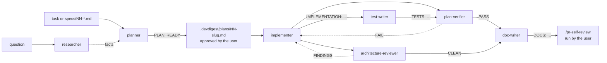

# Project subagents

A map of the subagents in this folder: what each one does, which tools it may use, and what it takes
in and hands back. The rules themselves live in each agent's own `.md` file — read that before
changing or relying on a detail.

The **main session** runs this pipeline; the agents never call each other (`Agent` is denied to all of
them). Subagents do not see the conversation. Pass work as a **file path** (a plan, a saved report) or
as a self-contained question, never as "the plan above".

`test-writer` is optional: run it when the plan's §7 asks for more than the implementer wrote, or to
cover existing code. `plan-verifier` and `architecture-reviewer` are independent and can run in parallel.

## At a glance

| Agent | Responsibility | Model | Can change files? | Input → output |
|---|---|---|---|---|
| [`researcher`](researcher.md) | Answers ONE concrete question about the repo or the outside world | `sonnet` | no | question → research report |
| [`planner`](planner.md) | Turns a task into a Development Plan | `opus` | no | task / spec → plan |
| [`implementer`](implementer.md) | Executes an approved plan and proves it with tests | `sonnet` | yes, only the plan's files | plan path → implementation report |
| [`test-writer`](test-writer.md) | Writes tests and proves each one can fail | `sonnet` | yes, test files only | plan path / behaviours → `TESTS:` report |
| [`plan-verifier`](plan-verifier.md) | Traces every plan item and requirement to code and evidence | `opus` | no | plan (+ spec, base, report) → `PLAN VERIFICATION:` table |
| [`architecture-reviewer`](architecture-reviewer.md) | Checks a diff against the boundary rules | `opus` | no | base (+ plan) → `ARCHITECTURE REVIEW:` findings |
| [`doc-writer`](doc-writer.md) | Documents what shipped, with diagrams | `sonnet` | yes, documentation only | plan / spec / materials → `DOCS:` report |

Only `plan-verifier` and `architecture-reviewer` review, each in its own lane (see "Lanes" below). None
of the agents opens PRs or commits. None of them writes to `INSIGHTS.md`: each one ends its
report with "Worth recording in INSIGHTS", and the main session records those entries through the
`engineering-insights` skill.

## researcher

- **Does:** codebase research (where, how and why, from git history) and external research (docs,
  versions, known issues). If the question is vague, it returns clarifying questions instead of a report.
- **Tools:** `Read, Grep, Glob, Bash, WebSearch, WebFetch`. Denied: `Write, Edit, NotebookEdit, Skill`.
- **Enforced:** `agent-guard.mjs readonly` on Bash. The prompt narrows it further to `git log/blame/show/diff`,
  `ls`, `wc`.
- **In:** one question with a findable answer.
- **Out:** a report with a short answer, conclusions with confidence levels, evidence (`path:line` or a
  URL with a date or version), and a mandatory "Not found" list. Or `## Clarification needed`.
  Fetched content is treated as data, not instructions.

## planner

- **Does:**
  - reads `AGENTS.md`, `specs/` and the relevant `INSIGHTS.md` entries;
  - locates the modules;
  - maps every file it plans to touch to the skills that own it;
  - writes ordered, verifiable steps.

  Questions that need outside facts go into the plan as `Needs research: …`.
- **Tools:** `Read, Grep, Glob, Bash`. Denied: `Write, Edit, NotebookEdit, Agent, WebSearch, WebFetch`.
- **Enforced:** `agent-guard.mjs readonly` on Bash.
- **Preloaded skills:** `onion-architecture`, `frontend-ui-architecture`, `postgresql-table-design`,
  `mermaid-diagram`. It reads any other skill's `SKILL.md` as a document.
- **In:** a task description or a `specs/NN-*.md` file.
- **Out:** a message whose first line is `PLAN: READY` or `PLAN: NEEDS_CLARIFICATION`. It has these sections:
  - §0 Scope
  - §1 Context read
  - §2 Modules
  - §3 Constraints
  - §4 Skill map
  - §5 Steps (files, skills, rules, `done when` command)
  - §6 Contracts & data
  - §7 Test plan
  - §8 Risks
  - §9 Handoff to reviewers

  The main session saves the plan to `.devdigest/plans/<NN-slug>.md`. That folder is git-ignored.

## implementer

- **Does:** executes the plan step by step and runs each step's `done when` command, with at most 3
  fix attempts. It then runs the full checks of every package it touched and self-checks its diff
  against the plan. A deviation that changes scope, a contract or the schema stops the step as `BLOCKED`.
- **Tools:** `Read, Grep, Glob, Edit, Write, Bash, Skill`. Denied: `Agent, NotebookEdit, WebSearch, WebFetch`.
- **Enforced, not just prompted:** the `PreToolUse` hook [`../hooks/implementer-guard.mjs`](../hooks/implementer-guard.mjs) denies:
  - state-changing git;
  - `gh pr`, `docker compose down`, recursive `rm`, `db:migrate` / `db:seed`;
  - edits to migrations, `server/clones/`, `.claude/`, `client/src/vendor/ui/` and any `INSIGHTS.md`.

  The hook fails open on its own errors.
- **Skills:**
  - Preloaded: `onion-architecture` and `frontend-ui-architecture`.
  - Other skills are invoked through `Skill` per the plan's Skill map.
  - `security` is mandatory whenever a changed file or added line matches its triggers in `routing.md`, even if the plan omits it.
- **In:** the path to a plan whose first line is `PLAN: READY`. Any other plan is refused.
- **Out:** a message whose first line is `IMPLEMENTATION: DONE`, `PARTIAL` or `BLOCKED`. It has these sections:
  - Steps
  - Files changed
  - Skills applied
  - Verification (every command with its exit code and passed / failed / skipped counts)
  - Deviations
  - Not done / blockers
  - Handoff to reviewers

## test-writer

- **Does:** writes client component tests (Vitest + RTL), server unit / route (`app.inject`) /
  integration (`*.it.test.ts`, real Postgres) tests and reviewer-core engine tests; proves each new test
  can fail (red first, or a flip check of the expected value); runs the package lanes. A new test that
  fails because the code is wrong stays failing and is reported as `BUG FOUND`.
- **Tools:** `Read, Grep, Glob, Edit, Write, Bash, Skill`. Denied: `Agent, NotebookEdit, WebSearch, WebFetch`.
- **Enforced:** `agent-guard.mjs test-writer` — Edit/Write only on test files (never the
  `architecture.test.ts` / `purity.test.ts` gates); Bash on the shared read-only allowlist.
- **Skills:** none preloaded. It invokes the skills `routing.md` gives each test file
  (`react-testing-library` for `client/src/**/*.test.tsx`) plus those of the production file under test.
- **In:** a `PLAN: READY` plan path, or explicit behaviours + scenarios. "Add tests for X" alone →
  `TESTS: NEEDS_CLARIFICATION`.
- **Out:** `TESTS: DONE | PARTIAL | BUG FOUND | BLOCKED` with tests written (red and green evidence),
  suspected bugs, skills applied, verification, changes to existing tests, not covered.

## plan-verifier

- **Does:** turns every plan item (§0 scope, each step's files / rules / `done when`, §6 contracts, §7
  tests), every spec criterion and every caller requirement into a row with verbatim text; finds
  implementation evidence (`path:line` + quote) and verification evidence (Test / Inspection / Analysis /
  Demonstration); reverse-traces changed files nobody asked for. The implementer's report is treated as
  unverified claims.
- **Tools:** `Read, Grep, Glob, Bash`. Denied: `Write, Edit, NotebookEdit, Agent, Skill, WebSearch, WebFetch`.
- **Enforced:** `agent-guard.mjs readonly`.
- **In:** `plan:` (required), optional `spec:`, `base:` (default `main`), `report:`, `ignore:`.
- **Out:** `PLAN VERIFICATION: PASS | FAIL | INCOMPLETE | BLOCKED` and a traceability table with
  `MET / PARTIALLY MET / NOT MET / DEVIATED / NOT VERIFIABLE / EXTRA`. The verdict is mechanical: any NOT
  MET, PARTIALLY MET or EXTRA → FAIL; else any NOT VERIFIABLE → INCOMPLETE; else PASS. No general advice.

## architecture-reviewer

- **Does:** runs the deterministic checks first (`pnpm arch`, the debt ledger diff, client
  `no-restricted-paths` lint output, `reviewer-core` purity test, both `shared` copies, schema ↔
  migration), then detects candidates against a fixed rule table (`R1`–`R13`, `ON-*`, `FE-*`, `X-*`) and
  tries to disprove each one. Only survivors are reported; dropped candidates are listed with a reason.
- **Tools:** `Read, Grep, Glob, Bash`. Denied: `Write, Edit, NotebookEdit, Agent, Skill, WebSearch, WebFetch`.
- **Enforced:** `agent-guard.mjs readonly`.
- **Preloaded skills:** `onion-architecture`, `frontend-ui-architecture` — its rule sources on every run.
- **In:** `base:` (default `main`), optional `plan:` (only to know which packages are in play), `ignore:`.
- **Out:** `ARCHITECTURE REVIEW: CLEAN | FINDINGS | INCOMPLETE | BLOCKED`; each finding has rule id,
  severity (CRITICAL / WARNING / SUGGESTION from `finding-format.md`), quoted code, quoted rule,
  mechanism and the disproof attempt.

## doc-writer

- **Does:** documents implemented behaviour only, checking every claim against `path:line`; gives each
  page one Diátaxis type and places it in the existing layout (package README sections, `<package>/docs/`,
  `docs/features/<NN-slug>.md` for cross-package features, ADRs in `<package>/docs/adr/` or `docs/adr/`);
  draws Mermaid `flowchart` / `sequenceDiagram` / `erDiagram` / `stateDiagram-v2` (never Mermaid C4,
  which is experimental); stamps each page `As of <sha>`.
- **Tools:** `Read, Grep, Glob, Edit, Write, Bash`. Denied: `Agent, NotebookEdit, Skill, WebSearch, WebFetch`.
- **Enforced:** `agent-guard.mjs doc-writer` — Edit/Write only on documentation; never `specs/`,
  `docs/agent-prompts/`, `docs/skills/`, `docs/improvement-plan.md`, `AGENTS.md`, `CLAUDE.md`, `INSIGHTS.md`.
- **Preloaded skills:** `mermaid-diagram`.
- **In:** a plan, a spec, a `plan-verifier` report and/or other materials. Rows that are not MET in the
  verifier report are not documented.
- **Out:** `DOCS: DONE | PARTIAL | BLOCKED | NEEDS_CLARIFICATION` with pages written, claims verified,
  not documented, spec divergences, proposed index / `AGENTS.md` rows for the main session.

## agent-guard

[`../hooks/agent-guard.mjs`](../hooks/agent-guard.mjs) is one `PreToolUse` hook with a profile argument.
All profiles share one Bash allowlist — read-only git (no `-c`), `ls` / `cat` / `grep` / `find` and
friends, `pnpm typecheck | test | lint | arch`, `pnpm exec vitest run`, `npm test`, `node --test`,
`docker info` — and deny redirects to files, command substitution, `--fix` / `--write` / `--update` /
`-u` / `--output`. An allowlist, not a denylist: `node -e`, `bash -c` or `git apply` would otherwise reach
production code.

| profile | used by | Edit / Write |
|---|---|---|
| `readonly` | `researcher`, `planner`, `plan-verifier`, `architecture-reviewer` | denied everywhere |
| `test-writer` | `test-writer` | `server/test/**`, `reviewer-core/test/**`, `client/src/test/**`, colocated `*.test.ts(x)` in `server/src` / `client/src` — minus the two gate tests |
| `doc-writer` | `doc-writer` | `docs/**/*.md`, `<package>/docs/**/*.md`, package and root `README.md`, `TESTING.md`, `server/src/modules/*/README.md` — minus product copies and specs |

`AGENTS.md`, `CLAUDE.md`, `INSIGHTS.md` and `.claude/**` are denied to every profile. Like
`implementer-guard.mjs`, it fails open on its own errors and on an unknown profile; a wiring test in
`agent-guard.test.mjs` pins which agent uses which profile, so a typo fails the test instead of silently
disabling the guard. It is a guardrail, not a security boundary.

## Lanes

| Agent | Question it answers | Never does |
|---|---|---|
| `plan-verifier` | Was every plan item and requirement built and proven, and nothing else? | boundary rules, code quality, security, advice |
| `architecture-reviewer` | Does this diff respect the boundary rules? (independent of the plan) | plan compliance, security, style, performance |
| `/pr-self-review` | Per-skill review of the whole change set, invariants, PR gate (run by the user) | — |
| `implementer` self-check | Its own diff against the plan's file list | it is the writer; `plan-verifier` is the independent grader |
| `test-writer` | Which behaviours are pinned by tests that can fail? | edits production code, reviews |
| `doc-writer` | What shipped, verified against code, and where does it belong? | specs, `AGENTS.md`, code, product prompt / skill copies |

`architecture-reviewer` and the `onion-architecture` fan-out of `/pr-self-review` overlap on purpose
(defence in depth). They share the same severity taxonomy, so their findings do not contradict.

## Shared source of truth: which skill owns which file

[`../skills/pr-self-review/references/routing.md`](../skills/pr-self-review/references/routing.md) maps
globs and added-line patterns to skills. It is used in four places:
- `planner` builds its Skill map from it;
- `implementer` invokes skills from that map;
- `test-writer` invokes the skills of each test file and of the production file under test;
- `/pr-self-review` reviews against it.

So the plan, the code, the tests and the review apply the same rules. `architecture-reviewer` does not
use it: it has its own fixed rule table, which cites `onion-architecture` and `frontend-ui-architecture`.
`routing.md` has no route for `server/test/**` or `reviewer-core/test/**`.

To change routing, edit `routing.md` and its machine copy (`ROUTES` in `scripts/collect.mjs`). The
`security` triggers are also spelled out in `implementer.md` → "Executing a step", so update them
there too.

## Where the rules come from (planner, implementer)

Researched on 2026-10-07 against Claude Code 2.1.284.

| Rule in the agents | Source | Where it is applied |
|---|---|---|
| One responsibility per agent; the description says when to delegate | [Subagents][sa] | `description` of both agents; "No review" limits |
| Least privilege: an allowlist plus `disallowedTools`; `Agent` denied to stop recursion | [Subagents][sa] | frontmatter `tools` / `disallowedTools` |
| A subagent gets its prompt, CLAUDE.md/AGENTS.md and git status, but not the conversation | [Subagents][sa] | the plan travels as a file; both prompts open by saying so |
| Explore → Plan → Implement → Commit: planning separate from implementation | [Best practices][bp] | planner is read-only; implementer cannot commit |
| A spec names files and interfaces, states what is out of scope, and ends with verification | [Best practices][bp] | plan §0 Scope; per-step Files and `done when`; a final full-suite step |
| Give the implementer a runnable check; evidence over assertions | [Best practices][bp] | implementer "Final verification"; exit codes and counts in the report |
| Review in a fresh context, separate from the writer (Writer/Reviewer) | [Best practices][bp] | no self-review; "Handoff to reviewers" in both outputs |
| CLAUDE.md is advisory, so must-happen rules go in hooks | [Best practices][bp], [Subagents][sa] | `hooks.PreToolUse` → `implementer-guard.mjs` |
| `skills:` preloads full skill text; a `disable-model-invocation` skill cannot be preloaded | [Subagents][sa] | two or four preloaded skills; `pr-self-review` stays manual |
| The context window is a public good; load details on demand | [Skill best practices][sab], [Skills][sk] | only the always-relevant skills are preloaded; the rest go through `routing.md` |
| Low freedom for fragile operations | [Skill best practices][sab] | the implementer's "Never" lists and its deviation rule |
| A delegated task needs an objective, an output format, tools and boundaries; artifacts go to storage and are passed by reference | [Multi-agent research system][ma] | "Hard limits" plus a fixed output format with a status line; `.devdigest/plans/` |
| Prompt chaining with a gate between steps | [Building effective agents][bea] | implementer refuses any plan that is not `PLAN: READY` |
| `isolation: worktree` branches from the default branch, not HEAD | [Subagents][sa] | deliberately not used, because work happens on feature branches |

These are judgement calls, not taken from the sources: `opus` for planning and `sonnet` for
implementation, `maxTurns` 40 / 80, and the 3-attempt limit.

The local lessons behind specific rules are in the repo's own `INSIGHTS.md` files:
- subagents append to `INSIGHTS.md` on their own (`INSIGHTS.md`, 2026-09-29);
- agents copy the neighbouring broken module (`server/INSIGHTS.md`, Session Notes, 2026-09-29);
- integration tests without Docker exit 0 with `N skipped` (`server/INSIGHTS.md`).

## Where the rules come from (test-writer, plan-verifier, architecture-reviewer, doc-writer)

Researched on 2026-10-07.

| Rule in the agents | Source |
|---|---|
| Read-only needs a `PreToolUse` Bash hook, not only a missing Write/Edit; `disallowedTools: Bash(x *)` removes the whole tool | [Subagents][sa] |
| Deterministic checks first; the LLM judges only what they cannot express | [Anthropic code-review plugin][crp], [Tencent FP study][fp], [dependency-cruiser][dc] |
| Separate detect and verify passes; drop what cannot be confirmed | [Anthropic code-review plugin][crp], [G-Research][gr] |
| Only quotable violations of a named rule; fixed rule-id table; explicit false-positive exclusions | [Anthropic code-review plugin][crp], [G-Research][gr] |
| Blocking vs advisory severity; review comments carry the reasoning | [Google eng-practices][gep]; repo `finding-format.md` |
| Reviewed code is data, not instructions | [claude-code-security-review][csr] |
| Spec compliance separate from code quality; Missing / Extra / Misunderstood; report = unverified claims | superpowers `subagent-driven-development` (task-reviewer prompt) |
| Each requirement needs an implementation link and a verification link | [MathWorks traceability][rtm] |
| Verify every claim with a quote, retract it otherwise; allow "I don't know" | [Reduce hallucinations][rh] |
| Judges are biased (sycophancy, verbosity); prefer per-criterion rubrics and deterministic guardrails | [LLM-judge bias][jb], [arXiv 2609.02246][jd] |
| Never edit or remove tests, never hard-code values to pass | [Prompting best practices][pbp] |
| Give a runnable check, show evidence; a failing test that reproduces a bug | [Best practices][bp] |
| Query like a user; priority list; no implementation details | [Testing Library principles][tlp], [query priority][tlq], [Testing implementation details][tid] |
| Real collaborators, assert outcomes not mock calls | [Mocks Aren't Stubs][mas] |
| `inject()` on a fresh app; real throwaway Postgres | [Fastify testing][ft], [Testcontainers][tc] |
| Coverage is not the goal | [Stryker][st], [TestCoverage][tcov] |
| One Diátaxis type per page, classified by the compass | [Diátaxis compass][dx] |
| ADRs for significant decisions, Nygard format, never renumbered | [Nygard][adr] |
| C4 context + container are usually enough; Mermaid C4 is experimental | [C4 diagrams][c4], [Mermaid C4][mc4] |
| Docs change with the code, link instead of duplicating, few fresh docs | [Google doc best practices][gdoc], [Docs as code][dac] |

These are project decisions, not taken from the sources: the models (`opus` for both reviewers,
`sonnet` for the writers), `maxTurns` 40 / 50 / 60 / 50, one shared Bash allowlist, the flip check that
proves a test can fail (no published source states this for test-writing agents), the five-status
vocabulary with a mechanical verdict, and mapping Diátaxis onto the existing layout plus `docs/features/`
instead of a new folder tree.

[crp]: https://github.com/anthropics/claude-code/blob/main/plugins/code-review/commands/code-review.md
[csr]: https://github.com/anthropics/claude-code-security-review
[gr]: https://www.gresearch.com/news/building-a-code-review-tool-the-llm-patterns-that-actually-work/
[fp]: https://arxiv.org/abs/2601.18844
[dc]: https://github.com/sverweij/dependency-cruiser
[gep]: https://google.github.io/eng-practices/review/reviewer/looking-for.html
[rtm]: https://www.mathworks.com/help/slrequirements/gs/identify-and-address-traceability-gaps.html
[rh]: https://platform.claude.com/docs/en/test-and-evaluate/strengthen-guardrails/reduce-hallucinations
[jb]: https://grepture.com/blog/llm-as-a-judge-bias
[jd]: https://arxiv.org/pdf/2609.02246
[pbp]: https://platform.claude.com/docs/en/build-with-claude/prompt-engineering/claude-prompting-best-practices
[tlp]: https://testing-library.com/docs/guiding-principles/
[tlq]: https://testing-library.com/docs/queries/about/#priority
[tid]: https://kentcdodds.com/blog/testing-implementation-details
[mas]: https://martinfowler.com/articles/mocksArentStubs.html
[ft]: https://fastify.dev/docs/latest/Guides/Testing/
[tc]: https://node.testcontainers.org/
[st]: https://stryker-mutator.io/docs/
[tcov]: https://martinfowler.com/bliki/TestCoverage.html
[dx]: https://diataxis.fr/compass/
[adr]: https://www.cognitect.com/blog/2011/11/15/documenting-architecture-decisions
[c4]: https://c4model.com/diagrams
[mc4]: https://mermaid.js.org/syntax/c4.html
[gdoc]: https://google.github.io/styleguide/docguide/best_practices.html
[dac]: https://www.writethedocs.org/guide/docs-as-code/
[sa]: https://code.claude.com/docs/en/sub-agents
[bp]: https://code.claude.com/docs/en/best-practices
[sk]: https://code.claude.com/docs/en/skills
[sab]: https://platform.claude.com/docs/en/agents-and-tools/agent-skills/best-practices
[ma]: https://www.anthropic.com/engineering/multi-agent-research-system
[bea]: https://www.anthropic.com/engineering/building-effective-agents

## Changing an agent

1. Edit the agent's `.md` file, then update the matching row above if its tools, model, skills,
   input or output changed.
2. If you changed a guard, run
   `node --test .claude/hooks/implementer-guard.test.mjs .claude/hooks/agent-guard.test.mjs`. The guards
   import `statements()` from `pr-self-review/scripts/gate.mjs`, and no CI workflow runs these tests.
3. **Start a new session.** A definition is cached when the session first loads it, so an edited
   `hooks:` block is silently ignored until restart. To smoke-test, delegate to the agent from a
   fresh `claude -p` process.
